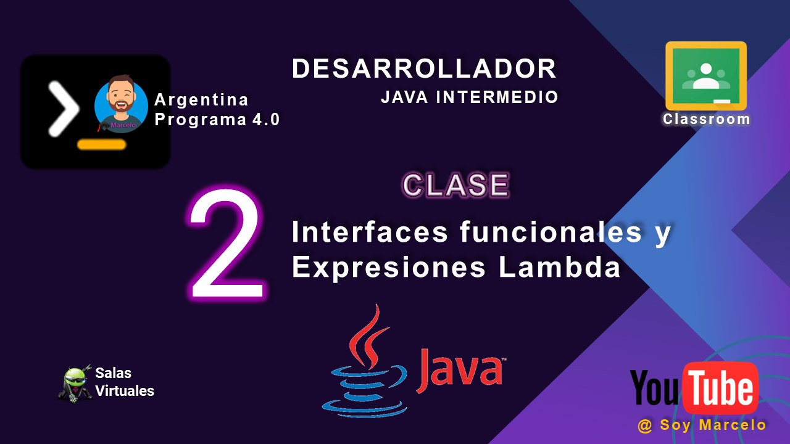

# clase_02
## Interfaces funcionales y Expresiones Lambda

[Descarga documento](./recursos/ACT-Clase_2-Interfaces_funcionales_ y_Expresiones_Lambdas.pdf)

Nos han solicitado el diseño y el desarrollo de un Validador de Inscripciones según materiaTRANSFORMADOR
Implemente un método que reciba como parámetro una lista de strings y una interfaz
funcional que transforme cada String de la lista en mayúsculas. El método debe devolver un
nuevo listado de String transformados.
## Youtube
[!Alt text](./recursos/caratulas_java_02.jpg)

<iframe width="560" height="315" src="https://www.youtube.com/embed/WE-BfDEBJ8c?si=P2ug991WRCsb0lmP" title="YouTube video player" frameborder="0" allow="accelerometer; autoplay; clipboard-write; encrypted-media; gyroscope; picture-in-picture; web-share" allowfullscreen></iframe>
